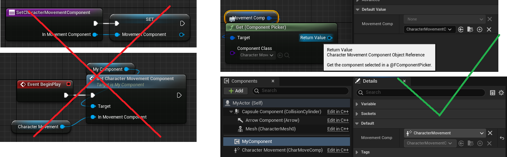
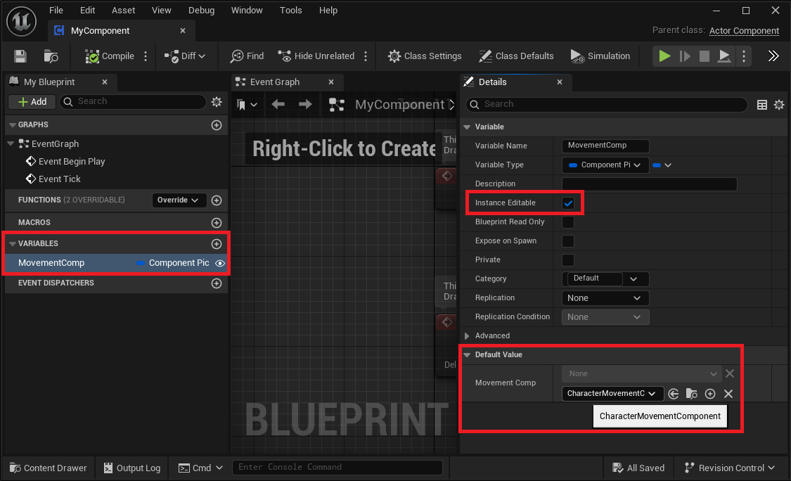
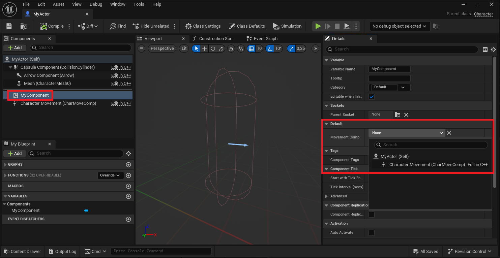
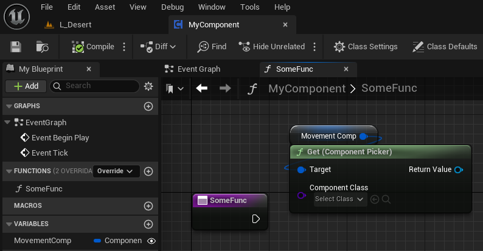

# Unreal Editor Component Picker

## Concept

Adds a `FComponentPicker` struct, with which you can 
pick an existing actor component via a drop-down menu at editor-time
and retrieve it in C++/BP at runtime.

This allows for a more Unity-like dependency injection pattern,
where component devs don't need to provide any kind of setter
method that has to be manually called to inject the dependency.

[<p align="center"></p>](./Docs/Motivation.png)

## Table Of Contents

* [Installation](#installation)
* [Development Status](#development-status)
* [Usage](#usage)
    * [Picker Property Configuration](#picker-property-configuration)
    * [Picking a Component](#picking-a-component)
    * [Retrieving a Component](#retrieving-a-component)

## Installation

The best way is to clone this repository as a submodule; that way you can contribute
pull requests if you want and more importantly, easily get latest updates. 
The project should be placed in your project's `Plugins` folder.

```
> cd YourProject
> git submodule add https://github.com/gregorhcs/UEComponentPicker
> git add ../.gitmodules
> git commit
```

Alternatively you can download the ZIP of this repo and place it in
`YourProject/Plugins/`.

## Development Status

This plugin is currently in an experimental state. There's at least one crash case I know of,
some bugs and some missing quality of life features and polish. 
It definitely wasn't battle-tested yet :)

You can see all improvements I'd like to make in the GitHub issues tab, but feel free to open issues I didn't find.
Also, any general feedback and pull-requests are much appreciated!

## Usage

### Picker Property Configuration

To configure a component picker in Blueprint, add a new `ComponentPicker` property to a component, 
expose it to be editable within the owning actor, compile, then set the allowed class in the default value.

[<p align="center"></p>](./Docs/BlueprintDefinition.png)

To configure a component picker in C++, add a new `FComponentPicker` property to a component, 
expose it to be editable within the owning actor, then set the allowed class in the constructor.

```C++
class UMyComponent : public UActorComponent
{
    GENERATED_BODY()
    
    UMyComponent()
    {
        MovementComp.SetAllowedClass(
            UCharacterMovementComponent::StaticClass());
    }

    ...
    UPROPERTY(EditAnywhere)
    FComponentPicker MovementComp;
    ...
}
```

### Picking a Component

After having done the setup above, you can add the component to an actor of your choice,
and pick another component on the same actor:

[<p align="center"></p>](./Docs/Picking.png)

### Retrieving a Component

To retrieve a picked component in Blueprint, you can call `Get (Component Picker)` on the property,
and specify the component type that should be returned. The function will return null, if casting fails.

[<p align="center"></p>](./Docs/BlueprintRetrieval.png)

To retrieve a picked component in C++, you can call `Get()` either with its default, `UActorComponent` 
returning version, or its templated variant.
```C++
void UMyComponent::SomeFunc()
{
    UActorComponent* AsActorComp = MovementComp.Get();
    auto* AsMovementComp = MovementComp.Get<UCharacterMovementComponent>();
}
```